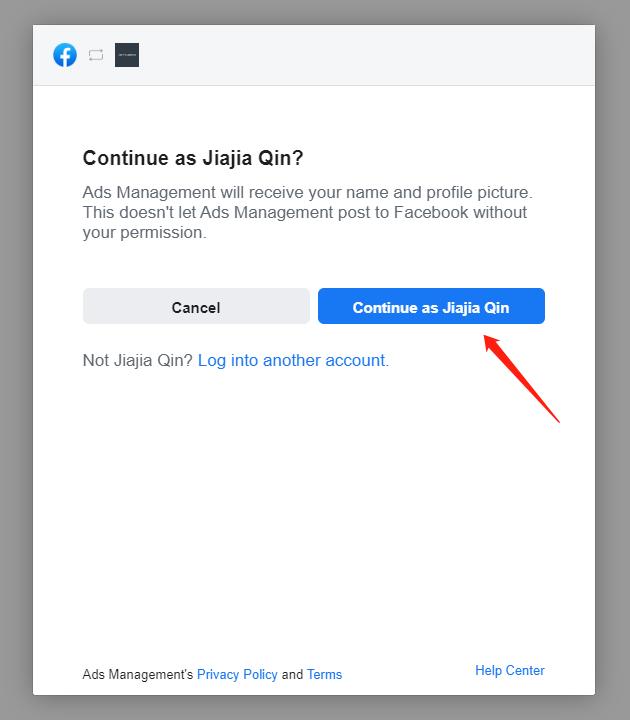
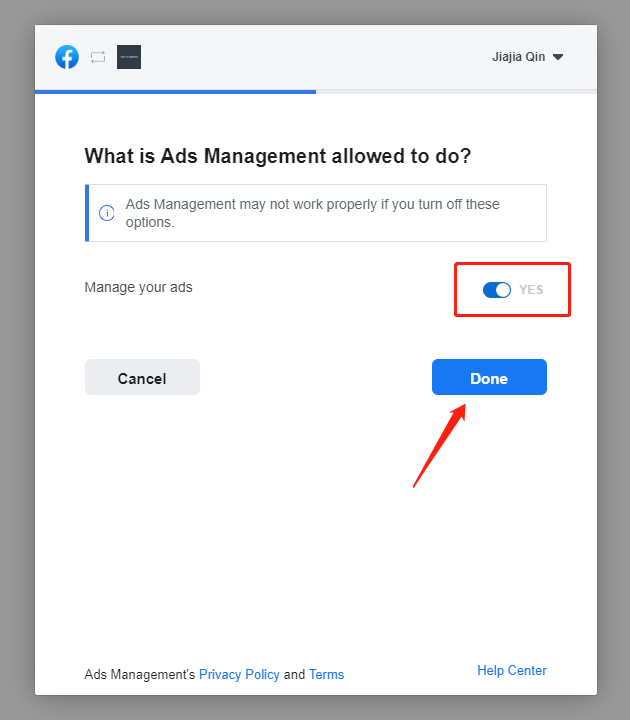
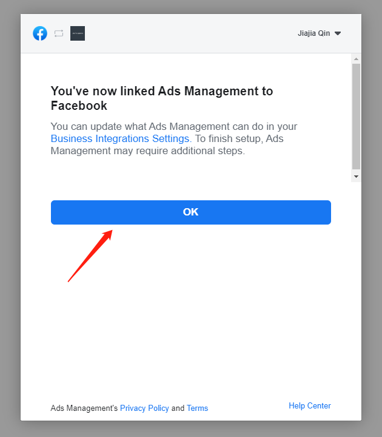

Guides of Syncing the Seeds to Ad Media
=======================================

Now you can sync your High Ad-Value Audiences data (hereafter called
"Seeds") to the specified ad media for user-targeted promotion.

Currently, only Facebook Ad accounts are supported as sync targets. The
Seeds can be synced to specified Facebook Ad accounts as "Ad Audience".

Facebook Ad account Authorization
---------------------------------

First of all, you need to authorize your Facebook Ad account to UPLTV.

When using this feature at the first time, you will find an "Authorize
Facebook Ad Account to UPLTV" button, just click the button to start
authorizing.

Click the "Jump to Facebook & Complete the authorization" button,
complete the authorization by following the instructions on the landing
page.

**Step 1 - Log in to the account you want to authorize, then click theContinue button:**

**Step 2 - Make sure the "Manage your ads" status is "Yes", then click the Done button:**

**Step 3 - Last step, click the OK button:**

**Done - when you get "succeeded":**

.. figure:: ../img/04.jpg
   :scale: 70 %
   :alt: picture 4

Some notes about the authorization
^^^^^^^^^^^^^^^^^^^^^^^^^^^^^^^^^^

When the authorization is completed, UPLTV will automatically obtain the
Facebook Ad accounts that allowed to be accessed by the authorized
developer account, and UPLTV will update the Ad accounts list regularly.

Also, you can replace the authorized account with a new one, but please
be cautions that all existing sync rules will be removed immediately.

The authorized token may be invaild in some special circumstances. When
it happens, you will find an "Re-authenticate" button. Please follow the
guide to re-authorize.

Create and edit sync rules
--------------------------

Once you have completed account authorization process, you are ready to
create a custom sync rule.

You can sync the Seeds from any of your multiple Apps to any number of
authorized Facebook Ad accounts.

Some notes about sync mechanism
-------------------------------

#. Synced Seeds data will be grouped into different "Facebook Ad audiences" by Apps, the rule of naming the "audiences" : **UART_[data]_[country]_[pid]_[type]_[accountID]**:

    data: date of last sync as format "yyyymmdd"

    country: The country code(ISO 3166-1) of the Seeds data，e.g: US,JP.

    pid: App ID in UPLTV.

    type: The data dimension that the Seeds generated based on, including "revenue" and "eCPM".

    accountID: Facebook Ad account ID.

#. UPLTV will update the "audiences" every day by adding new Seeds &
   removing discared Seeds.

#. The sync program starts at 12pm (UTC) every day, and will finish in
   30 minutes.